# VS Code TypeSpec Extension Test Plan

## Test Environment

* OS : Windows or Linux
* Language : Python, Java, JavasSript, .NET

> Note: The extension should support all test cases in VS Code for Windows and Linux. Mac support is a stretch goal for Selenium semester.

## Prerequisites

Install TypeSpec Compiler before starting to write TypeSpec.

* [Node.js 20+](https://nodejs.org/download/)
* Npm 7+
* Install TypeSpec Compiler CLI: `"npm install -g @typespec/compiler"`

## Test Cases

The TypeSpec Extension aims to provide end-to-end TypeSpec support for non-branded services, covering the following test cases:

1. [Create TypeSpec Project from A Template](#test-case-1-create-typespec-project-from-a-template)
2. [Generate Client Code from TypeSpec](#test-cases-2-generate-client-code-from-typespec)
3. [Generate OpenAPI 3.x from TypeSpec](#test-cases-3-generate-openapi-3x-from-typespec)
4. [Generate Server Stub from TypeSpec](#test-cases-4-generate-server-stub-from-typespec)
5. [Import TypeSpec from OpenAPI3 _(stretch goal for SE)_](#test-cases-5-import-typespec-from-openapi3-stretch-goal-for-se)

## Test Steps

### Test Case 1: Create TypeSpec Project from A Template

New TypeSpec projects can be created using a variety of templates for specific purposes. TypeSpec supports the following non-branded templates:

* Empty Project
* Generic REST API
* TypeSpec Library (with TypeScript)
* TypeSpec Emitter (with TypeScript)

Selecting a template involves:

* Installing required libraries
* Initializing essential project files with a specified folder structure
* Configuring output settings for a designated emission purpose

#### Step 1: Install the typespec extension.

_Option 1_. Install using .vsix file: 
   `Extension` -> `…` -> `Install form VSIX...`
   
   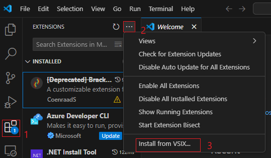

   Find the .vsix file you want to install locally.
   
   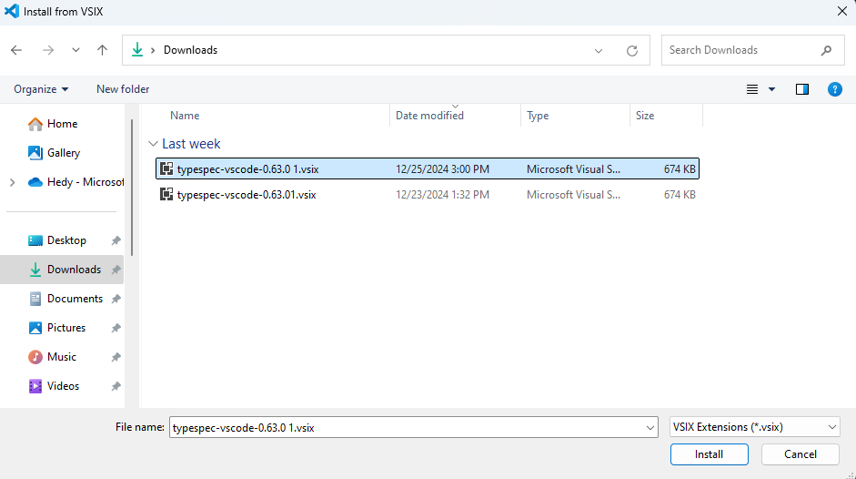

_Option 2_. Install typespec with vscode extension marketplace:
   `Extension` -> input `TypeSpec for VS Code` -> `Install`
   
   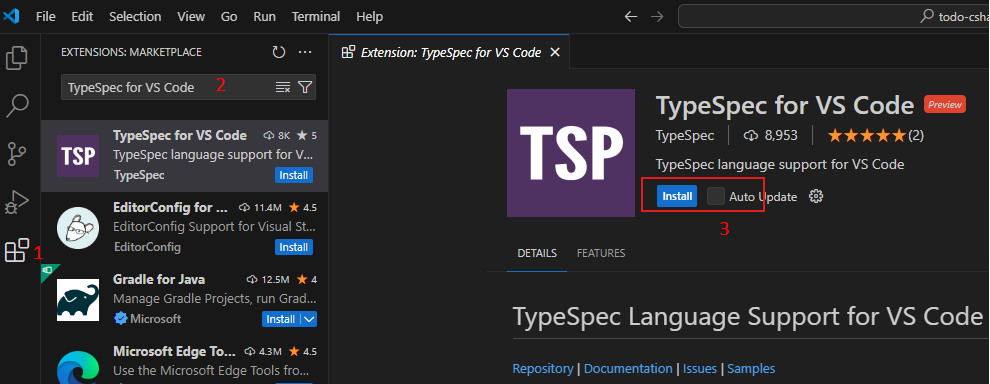

#### Step 2: Trigger create TypeSpec Project

_Option 1_. Clicking “Create TypeSpec Project” button/link in the “No Folder Opened” View of Explore.
   
   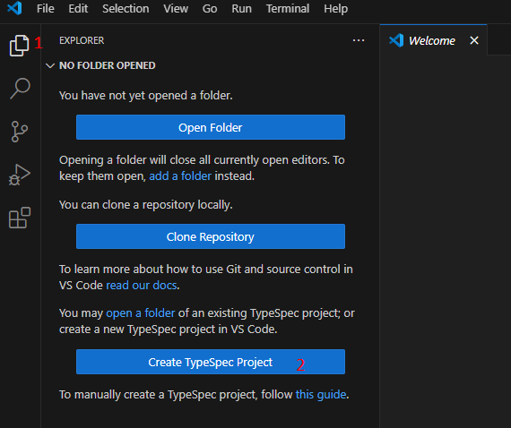

_Option 2_. Typing `> TypeSpec: Create TypeSpec Project` in the _Command Palette_.
   
   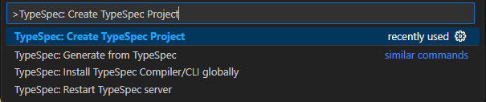

#### Step 3. Select an empty folder as the root folder for the new TypeSpec project.
   
   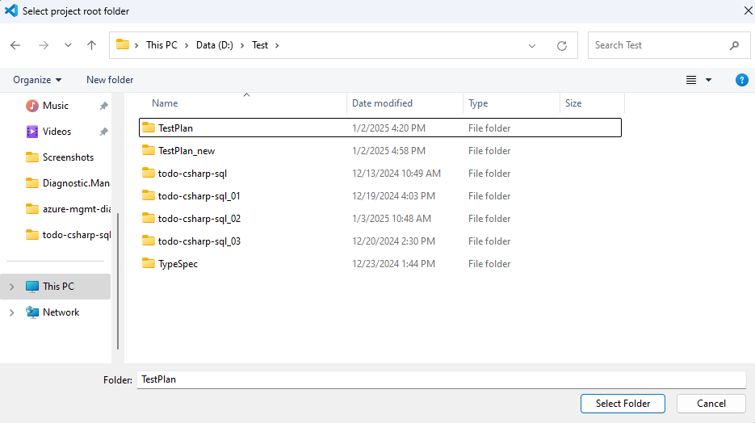

#### Step 4. Check if TypeSpec Compiler CLI is installed.

If the TypeSpec Compiler is not installed, the Quick Pick will initiate the installation of the TypeSpec Compiler. If TypeSpec Compiler is installed, Skip to the next step.
   
   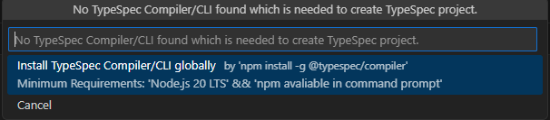

#### Step 5. After successfully installing TypeSpec Compiler, will go through the questions of `tsp init`.
   1. If the specified folder is not empty. If the folder is empty, skip to the next step.

   &emsp;&emsp;**Validate:** Will it appear: `Folder C:\xxx\xxx\xxx is not empty. Are you sure you want to initialize a new project here?`

   2. Select a template.

   &emsp;&emsp;**Validate:** There should be a prompt "Select a template", and should see four options: `Empty project`, `Generic REST API`, `TypeSpec Library (With TypeScript)`, `TypeSpec Emitter (With TypeScript)`.

   3. Input project name.

   4. Choose whether to generate a .ignore file.

### Test Cases 2: Generate Client Code from TypeSpec

Generate client code from TypeSpec. In VS Code extension, we can complete code generation with step-by-step guidance.  
TypeSpec Extension support will be extended to client code generation for first-class languages: `.NET`, `Python`, `Java`, and `JavaScript`.

**Important: There must be at least one TypeSpec project in the project folder.**

#### Install the required tools when Generate Client Code

Install required SDK/runtime for executing the specified language:
* [.NET 8.0 SDK](https://dotnet.microsoft.com/en-us/download)
* [Java 11 or above](https://www.oracle.com/java/technologies/downloads/), and [Maven](https://maven.apache.org/download.cgi)
* [Python 3.8+](https://www.python.org/downloads/)
* [Node.js 20+](https://nodejs.org/download/)

#### Step 1 are the same as [Tast Case 1](#test-case-1-create-typespec-project-from-a-template).

#### Step 2: Trigger generate from TypeSpec

Generation from a TypeSpec can be triggered in two ways:

_Option 1_. Clicking `Generate from TypeSpec` in the _Context Menu_ for a .tsp file in the extended TypeSpec project.
   
   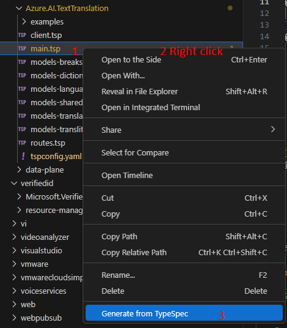

_Option 2_. Typing `>TypeSpec: Generate from TypeSpec` in the _Command Palette_ with at least a TypeSpec project folder extended in the _Side Bar_.
   
   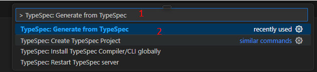

#### Step 3: Click the command `TypeSpec: Generate from TypeSpec`, and choose a project.

   **Validate:** There should be a prompt "Select a Typespec Project".

   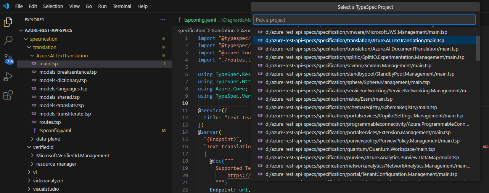

#### Step 4: Select an Emitter Type.

   **Validate:** There should be a prompt "Select an Emitter Type", and should see three emitter types: `Client Code`, `<PREVIEW> Server Stub`, `Protocal Schema`.

   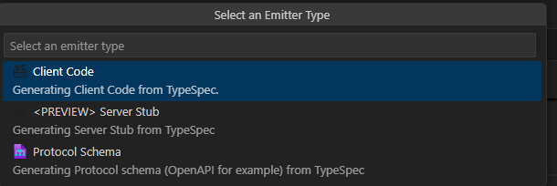

#### Step 5: Click `Client Code`.

   **Validate:** There should be a prompt "Select a Language", and should see four languages: `DotNet`, `Java`, `JavaScript`, `Python`.

   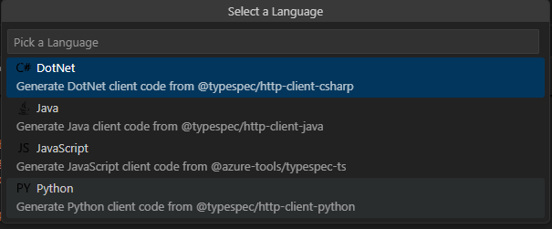

#### Step 6: Select a Language, the TypeSpec to client code generation is initiated at the back end.

   **Validate:** The result appears as a Notification in the bottom right corner, and generate the client folder.

   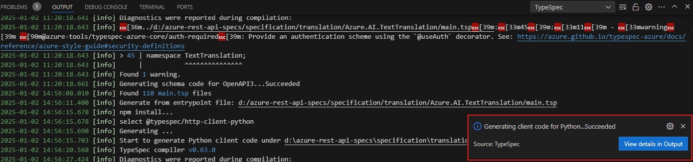
   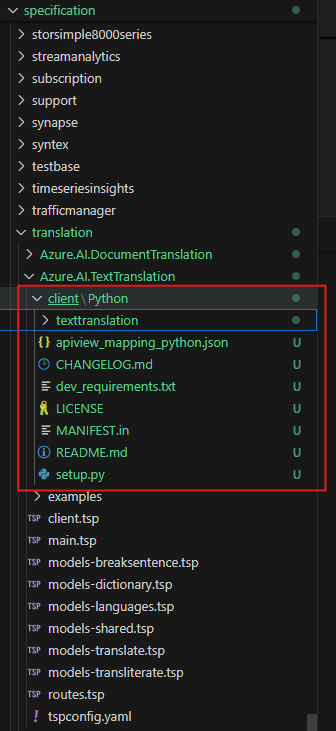

### Test Cases 3: Generate OpenAPI 3.x from TypeSpec

Emit OpenAPI3 from TypeSpec to automate API-related tasks: generate API documentation, test API, etc.
The TypeSpec file itself is not sufficient to generate OpenAPI 3. The conversion process will always reference the entry point (main.tsp) of the TypeSpec build, which includes the main definitions of models, services, and operations.

**Important: There must be at least one TypeSpec project in the project folder.**

#### Step 1 are the same as [Tast Case 1](#test-case-1-create-typespec-project-from-a-template).

#### Step 2-4 are the same as [Tast Case 2](#test-cases-2-generate-client-code-from-typespec).

#### Step 5: Click `Protocal Schema`.

   **Validate:** There should be a prompt "Select a Language", and should see languages: `OpenAPI3`.

   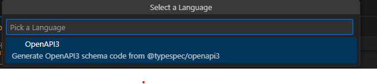

#### Step 6: Select a Language, the TypeSpec to OpenAPI generation is initiated at the back end.

   **Validate:** The result appears as a Notification in the bottom right corner, and generate the schema folder.

   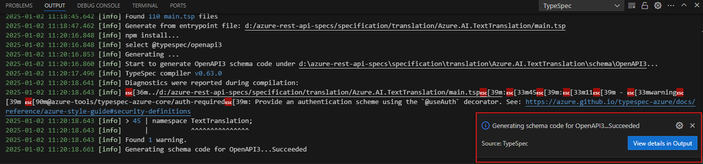
   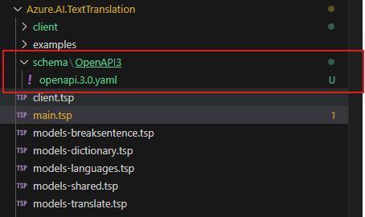

### Test Cases 4: Generate Server Stub from TypeSpec

The service stub generation support will be PREVIEWED for 2 languages: `.NET` and `JavaScript`.
> Note: Server Stub Emitter is currently under PREVIEW.

**Important: There must be at least one TypeSpec project in the project folder.**

#### Step 1 are the same as [Tast Case 1](#test-case-1-create-typespec-project-from-a-template).

#### Step 2-4 are the same as [Tast Case 2](#test-cases-2-generate-client-code-from-typespec).

#### Step 5: Click `<PREVIEW> Server Stub`.

   **Validate:** There should be a prompt "Select a Language", and should see two languages: `DotNet`, `JavaScript`.

   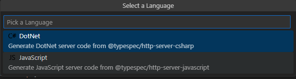

#### Step 6: Select a Language, the TypeSpec to Server Stub generation is initiated at the back end.

   **Validate:** The result appears as a Notification in the bottom right corner, and generate the server folder.

   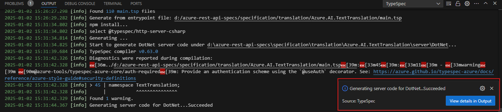
   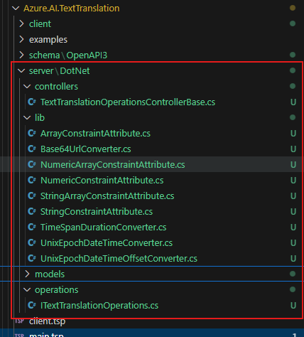
   
### Test Cases 5: Import TypeSpec from OpenAPI3 _(stretch goal for SE)_

With the TypeSpec emitter for OpenAPI3, users can import a TypeSpec file from a designated OpenAPI3 document. While it is possible to repeatedly convert OpenAPI3 to TypeSpec.

#### Step 1: "Import TypeSpec from OpenAPI 3.0" from the right-click context menu of a .tsp file.

#### Step 2: Identify the project folder where you will place the TypeSpec file converted from the specified OpenAPI3 specification.

#### Step 3: Specify the OpenAPI3 specification to convert.

#### Step 4: Verify that @typespec/http and @typespec/openapi3 are installed.

## Issue Report

When an error is detected, it’s necessary to document the findings by using the following form:

| No | Title | Emitter Type | Language | Issue Description | Repro Steps | Expected Results | Actual Results | Comments |
| ---------| :--: | :-: | :--: | :--: | :--: | :--: | :--: | :--: |
| 1 | e.g. Create typespec project failed | N/A | N/A | Create project feature is not supported by the current TypeSpec Compiler (ver <= 0.63.0). Please upgrade TypeSpec Compiler and try again. | 1. Typing `>TypeSpec: Create TypeSpec Project` in the _Command Palette_.   2. Select an empty folder as the root folder for the new TypeSpec project.   3. Select a template. | There should be a prompt "Select a template", and should see four options: `Empty project`, `Generic REST API`, `TypeSpec Library (With TypeScript)`, `TypeSpec Emitter (With TypeScript)`. | Create project feature is not supported by the current TypeSpec Compiler (ver <= 0.63.0). Please upgrade TypeSpec Compiler and try again. | Issue link |

## Test Results Summary

The test results will be presented in the following form:

| NO | Test Cases | Platform | Language | Result | Issues | Comments |
|  --------------- | :-: |:-: | :--: | :--: | :--: | :--: |
| 1 | Create TypeSpec Project from A Template | Windows/Linux | N/A |  |  |  |
| 3 | Generate Client Code from TypeSpec | Windows/Linux | Python |  |  |  |
| 4 | Generate Client Code from TypeSpec | Windows/Linux | Java |  |  |  |
| 5 | Generate Client Code from TypeSpec | Windows/Linux | .NET |  |  |  |
| 6 | Generate Client Code from TypeSpec | Windows/Linux | JavaScript |  |  |  |
| 7 | Generate OpenAPI 3.x from TypeSpec | Windows/Linux | OpenAPI3 |  |  |  |
| 8 | Generate Server Stub from TypeSpec | Windows/Linux | DotNet |  |  |  |
| 9 | Generate Server Stub from TypeSpec | Windows/Linux | JavaScript |  |  |  |
| 10 | Import TypeSpec from OpenAPI3 _(stretch goal for SE)_ | Windows/Linux | N/A |  |  |  |
